# Stateful Coordinator

This discussion aims to clarify and address the critique mentioned in #1120.
Implementation details, architecture, and models for parallelism are left out.
Instead, I want to focus on what comprises a consistent state of the coordinator and how it is maintained.
Further requests that were made include testing strategies and an overview on other systems' metadata services.

## Role and Responsibilities

The coordinator acts as the controller and maintainer of the deployment, fulfilling three primary roles:
1.  **Metadata Repository:** It maintains the authoritative, consistent state of the entire cluster (infrastructure and workloads).
2.  **Control Plane:** It acts as the middleware between external clients and internal worker nodes, orchestrating all changes.
3.  **Cluster Manager:** It reacts to internal events (faults, heartbeats) and makes designs on cluster membership based on those.

### Core Components

The coordinator is composed of three high-level services:

#### 1. Catalog (State Store)
Centralized, durable storage for all metadata entities. Serves as the "Source of Truth."
*   **Infrastructure:** Workers, Network Links.
*   **Workload:** Queries, Sources, Sinks.
*   **Security (Future):** Users, Permissions, ACLs.
*   **Statistics (Future)**: CPU/Memory/Network usage across the Topology.

#### 2. Network Service (Cluster Manager)
Handles communication between the coordinator and the worker nodes. 
Abstracts the network complexity from the rest of the system.
Only acts as a transmission component that forwards and collects messages on behalf of a higher-level component.
*   **Connection Management:** Maintains persistent RPC connections to all workers.
*   **Failure Detection:** Detects unreachable workers via heartbeats and dynamic timeouts.
*   **Reconciliation:** Attempts to reconnect to failed or partitioned workers.
*   **Instruction Dispatch:** Forwards commands (e.g., `StartFragment`, `StopFragment`) to specific workers.
*   **Telemetry Gathering:** Collects query state changes, statistics, health reports, etc.

#### 3. Query Service (Workload Manager)
Orchestrates the lifecycle of continuous queries, ensuring they transition correctly from submission to execution and termination.
*   **Reconciliation:** Drives the state of distributed queries to match the desired state in the Catalog (e.g., retrying failed deployments, cleaning up zombie fragments).
*   **Monitoring:** Subscribes to query state changes and preparing status updates for clients. 

Later, we might have an active component (FlowOptimizer) that maintains the placement (mapping of operators to workers) as a) workload and b) infrastructure changes flow into the system.
This FlowOptimizer uses the gathered statistics about resource usage by operators/pipelines and rearranges the placement to meet certain requirements like total system throughput or SLAs for individual queries. 
Before that can be introduced, we need mechanisms for a) query reconfiguration on the worker side, and b) dynamic cluster membership.

## Status Quo

Currently, the system is accessible via three entry points:
1. The **system-level test (SLT)** tool. Used for end-to-end testing, it loads a set of test files, parses them, and submits a set of queries to an embedded/remote NES worker. It maintains its own logic for binding, tracking progress/status, and checking query results.
2. **Nebuli/YAML**. One-shot binary target that takes a stateless approach.
   It takes command line arguments for query manipulation requests (register/start/stop/unregister/status) and either a YAML configuration (register) or a query id (start/stop/unregister), matching the interface of the current GrpcQueryManager.
   It only supports an API for queries, with source/sink descriptions contained in the query register request. The approach taken here shifts the responsibility for managing the query's progress to the user.
   This breaks the abstraction principle; clients should describe 'what' they want, not micromanage 'how' the cluster executes it.
3. **Statement API/REPL**. Introduces DDL statements, including creating/showing/dropping queries/sources/sinks. Implements basic query tracking functionality.
   Currently, workers' capacities are reset after each query, rather than operators truly consuming capacity and returning it when the query terminates.

We want to introduce new frontends in the future, such as REST clients (used by the UI) and programming language clients.
They should not need to know or care about all the individual components that are necessary to drive a query from the SQL string to a running distributed query.

## Problems
1. Writing a new frontend requires pulling in numerous components such as the parser, binder, planner, and query manager.
   Frontends invoke these components directly, duplicating logic or using them inconsistently.
   This doesn't scale well when adding new frontends (e.g., language clients, REST APIs), because changes propagate to multiple parts of the codebase.
   Frontends can currently plan and track queries however they choose, rather than adhering to a single interface.
2. NES runs continuous (i.e., long-running) queries over unbounded data.
   Without maintaining state, we cannot effectively manage the deployment and its entities over a prolonged period.
   We can't meaningfully collect heartbeats and statistics from workers to keep the cluster together, track worker capacities when allocating workloads, or trigger reoptimization of running queries.
   Therefore, maintaining state is a prerequisite for all of these follow-up tasks.
3. Our data model is not clearly defined and does not account for the relational nature of some entities.
   For example, deleting a source does not affect the queries that use it, nor does it throw an error.
   In its current state, it would be unclear how introducing a persistent state in the coordinator would work.

## Scope

To move quickly from PoC to running coordinator, we limit scope as follows:
- We start with a single centralized coordinator. See #1120 for rationale. Therefore, clients send requests only to the coordinator, and workers cannot make decisions affecting other workers locally.
- The coordinator initially won't expose a network interface. As a result, we must embed the coordinator into frontends as a library.
- To leverage the existing gRPC machinery, all coordinator-worker communication will be pull-based, initiated by the coordinator via RPC. Switching to a push-based model for events like cluster membership and statistics may benefit us later, but it's out of scope for this initial PoC.
- Performance will not be a consideration initially. Once we understand expected load patterns, we can optimize for them. We focus on reliability, correctness, and simplicity first, then tackle performance issues.
- In the NES vision, we aim to cope with both infrastructure and workload changes. Currently, only dynamic workloads are supported, so we will maintain this setup and implement dynamic cluster membership down the line.
- Query reconfiguration will not be considered because key requirements such as state migration and statistics, are not yet present in the system. As a result, fault tolerance for queries can only be achieved by restarting a query fragment or the whole query.

## Assumptions

NES is a distributed system with two types of executables:
- A single coordinator/frontend process
- n worker processes

Those are arbitrarily placed on a set of nodes and can communicate via the network, with the following restrictions:
- The coordinator can talk to all workers via RPC (although this may not be true in all real-world scenarios).
- The coordinator initiates all communication to workers, not the other way around.
- Workers can communicate as specified in a static topology definition (currently, a directed acyclic graph).
- Communication between workers is initiated from the source node of a directed edge (worker1 -> worker2).

We further assume the following properties hold in the system:
### Nodes
We assume a crash-recovery model: worker processes or entire nodes can crash at any time but may resume later.

### Network
We assume reliable communication between coordinator and workers (exactly-once, in-order delivery).
TCP guarantees these properties hold if the connection stays alive. 
It does not guarantee delivery across a connection reset.
Therefore, we cannot assume end-to-end exactly-once, in-order delivery at the application level.
Connection reincarnations after crashes may duplicate messages because the networking stack doesn't understand application semantics.

### Timing
We assume a partially synchronous timing model:
- Nodes may pause execution (e.g., when other threads run)...
- Messages may be delayed (e.g., due to network congestion)...
  ...arbitrarily for a finite but unknown duration.

### Expected Workloads
NES runs continuous queries over unbounded data.
This means:
- The system as a whole may run for a long time.
- Queries may run for a long time.
  Additional load parameters depend on real-world expectations and optimization goals. For example:
- What changes most frequently? Workloads, data, or infrastructure?
    - If data characteristics change rapidly, we should trigger reoptimization often.
    - If workloads change often, we should optimize for response time.
    - If infrastructure changes often, we should have dynamic membership and state/query migration.
- Do we expect more ad-hoc queries that come and go, or long-running queries?
- Do we expect queries to be submitted in a single batch or continuously over time?
- Are the requests to the coordinator read-heavy (querying or displaying parts of its state) or write-heavy (creating/dropping entities)?
- How large do we expect the different entities to be? (e.g., thousands of queries, millions of sources)

For these reasons, performance is initially out of scope, as we do not yet have a clear picture of the load characteristics or the workloads NES should be optimized for.

### Requirements

Requirements ordered by importance: functionality, reliability, flexibility, performance.
1. Functionality: implement a basic MVP that correctly processes user-friendly requests. The coordinator won't proactively trigger reoptimization yet.
2. Fault Tolerance: the system continues functioning despite (partial) faults. Gracefully handle increased load by applying backpressure to frontends. The coordinator detects and responds to faults rather than failing requests immediately.
3. Flexibility: implement networking facilities so we can deploy the coordinator independently or even embed it on worker nodes. This enables sharing the coordinator across different frontends and clients.
4. Performance: implement mechanisms for deduplication, compaction, batching, merging, parallel RPCs, etc.

```mermaid
graph TD
subgraph Client/Frontend Process
REPL(REPL/UI Client) --> Coordinator[Coordinator: API Endpoint]
Coordinator -- Query Catalog API --> InternalCatalog(Catalog / State Store (SQLite))
end

subgraph Distributed Workers
WorkerA(Worker A)
WorkerB(Worker B)
WorkerC(Worker C)
WorkerD(Worker D)
end

Coordinator -- gRPC Instructions (Start/Stop Query Fragments) --> WorkerA
Coordinator -- gRPC Instructions (Start/Stop Query Fragments) --> WorkerB
Coordinator -- gRPC Instructions (Start/Stop Query Fragments) --> WorkerC
Coordinator -- gRPC Instructions (Start/Stop Query Fragments) --> WorkerD

WorkerA -- Intermediate Results --> WorkerB
WorkerA -- Intermediate Results --> WorkerC
WorkerB -- Intermediate Results --> WorkerD
WorkerC -- Intermediate Results --> WorkerD

WorkerA -- Heartbeats & Telemetry --> Coordinator
WorkerB -- Heartbeats & Telemetry --> Coordinator
WorkerC -- Heartbeats & Telemetry --> Coordinator
WorkerD -- Heartbeats & Telemetry --> Coordinator

style Coordinator fill:#f9f,stroke:#333,stroke-width:2px
style REPL fill:#ccf,stroke:#333,stroke-width:2px
style InternalCatalog fill:#eef,stroke:#333,stroke-width:2px
style WorkerA fill:#afa,stroke:#333,stroke-width:2px
style WorkerB fill:#afa,stroke:#333,stroke-width:2px
style WorkerC fill:#afa,stroke:#333,stroke-width:2px
style WorkerD fill:#afa,stroke:#333,stroke:#333,stroke-width:2px
```

## Catalog

The coordinator acts as the "Brain" of the system. 
It must maintain a consistent view of the following state:

1.  **Infrastructure:**
    *   **Workers:** Identity, network address, capacity (slots), and health status.
    *   **Topology:** Network links and reachability between workers.
2.  **Workload:**
    *   **Queries:** Name, SQL statement, logical plan, and desired/current state.
    *   **Fragments:** Decomposed parts of a query assigned to specific workers and their current state.
    *   **Sources:** Schema definitions and their physical instantiations on nodes.
    *   **Sinks**

### Storage Engine: Embedded Relational (SQLite)

I propose using an **embedded relational database (SQLite)**.
SQLite provides serializable transactions, WAL-based durability, and a single-file format that makes the coordinator portable and easy to back up.

**Proposal:** We will adopt a **Hybrid Relational/Document Model**.
*   **Relational (Strict):** Used for the "Skeleton" of the system—entities (Queries, Workers) and their relationships (Foreign Keys). 
This enforces referential integrity (e.g., "You cannot drop a Logical Source if a Physical Source or Query depends on it").
*   **Document (Flexible):** Used for "Configuration"—sources, sinks, and schemas are stored as **JSON Blobs**. This allows us to add new source types or parameters without running database migrations.


*Advantages:*
- Allows us to naturally model the interrelated metadata entities 
- Eliminates the need for application-level joins.
- Supports transactions, checks, constraints, triggers, and stored procedures. Validation of numerous invariants and implementation of concurrency control protocols can be shifted to the DB engine.
- An embeddable solution has the advantage of easier deployment for users.
  Kafka, for example, spend years removing their dependency on ZooKeeper, because users frequently complained about the overhead of maintaining two distributed systems.

*Disadvantages:*
- Requires boilerplate ORM mapping between database objects and in-memory representations.
- Derived in-memory collections (like topology and query graphs) require keeping database and memory in sync.

### Alternative Models Considered

#### Key-Value (KV) / Log-Structured
*Advantages:* 
- High write throughput
- Simple to use
- Natural fit for event sourcing (Raft)
 
*Disadvantages:* 
- Poor support for complex relationship queries (e.g., finding all queries using a specific source). 
- Requires implementing application-level joins and integrity checks, which moves database logic into the application layer.
- No or limited support for transactions

#### Graph Model
*   *Advantages:* Natural representation of query plans and network topologies that have graph-like structure.
*   *Disadvantages:* Introduces a heavy dependency (e.g., Neo4j). While some access patterns are traversal-based ("Find a path"), others are lookup-based ("Get status of Query X").

The data model will change in the future, but to begin with, something like this might work:


This approach unifies the former `SinkCatalog`, `SourceCatalog`, `WorkerCatalog`, and `QueryCatalog` into a single, coherent data model.
To manage access control and define what actions a component can perform with the catalog, we can expose a specific subset of methods through these specialized catalogs.
Despite this abstraction, all these catalogs interact with the same underlying database.

The following static internal tables, for instance, are not modified by client requests:
- `worker_states`: `[ACTIVE, UNREACHABLE]`, indicating whether the worker is healthy or currently not reachable.
- `query_states`: `[PENDING, DEPLOYING, RUNNING, STOPPING, STOPPED, TERMINATED, FAILED]`, which represents the possible states of an entire query from the coordinator's viewpoint.
- `query_fragment_states`: `[REGISTERED, STARTED, RUNNING, STOPPED, TERMINATED, FAILED]`, mirroring the states a query fragment can adopt within a worker's `QueryEngine`.
- `source_types`: `[FILE, TCP]`, used to reject requests specifying non-existent source types.
- `sink_types`: `[FILE, PRINT]`, used to reject requests specifying non-existent sink types.

I propose to store query plans and source/sink configurations in their serialized JSON/Protobuf formats **for now**.
Configurations can't easily be validated in the DB but in the application code, using descriptors.
To facilitate recovery from coordinator crashes, serialized plan fragments are stored; these can be resent to worker nodes upon recovery.
Until we implement query reconfiguration (which involves shifting parts of a plan to different nodes), there is no need to store individual operators within the catalog.

A core principle is that the catalog must represent the **source of truth**.
Consequently, the catalog's data must be free of faults or inaccuracies.
For instance, we must not store a misconfigured TCP source or a query containing a syntax error directly in the catalog.
This necessitates running validation logic (e.g., validating descriptors, invoking the SQL planner) prior to any data insertion.
This approach ensures a consistent state, even after recovering from a coordinator crash.

## Messages
Changes to the coordinator's state can originate from external clients, taking the form of requests:
- UI
- REST server
- Systests
- REPL
- Language clients

Alternatively, state changes can arise from internal components, such as workers, in the form of events:
- Statistics from workers regarding throughput, network round-trip time to peers, network bandwidth, and task queue backlog size.
- Heartbeats
- Query State Changes

| Message Source | Requires Response | Requires Reliable Transmission | Frequency                  | Volume      | Example                                    |
|----------------|-------------------|--------------------------------|----------------------------|-------------|--------------------------------------------|
| External       | Yes               | Yes                            | fluctuating, unpredictable | low/medium  | Client requests (CreateQuery, DropSource)  |
| Internal       | Mostly not        | Mostly not                     | constant, predictable      | medium/high | Statistics, Heartbeats                     |

The coordinator's job is to incrementally maintain the deployment's state as requests and events flow into the system.

### User-facing Requests

#### Overview

| Request Name           | Target Entity    | Type   | Arguments                                                                                   | Response                                                                 | Network Involved | Possible Errors                                                                                                                                                  |
|------------------------|------------------|--------|---------------------------------------------------------------------------------------------|--------------------------------------------------------------------------|------------------|------------------------------------------------------------------------------------------------------------------------------------------------------------------|
| `CreateLogicalSource`  | Logical Sources  | CREATE | `name`<br>`schema`                                                                          | `Result<(), Err>`                                                        | No               | `AlreadyExists`<br>`EmptySchema`<br>`InvalidSchema`                                                                                                              |
| `CreatePhysicalSource` | Physical Sources | CREATE | `logical_source_name`<br>`placement`<br>`source_type`<br>`source_config`<br>`parser_config` | `Result<PhysicalSourceId, Err>`                                          | No               | `AlreadyExists` (how to check that?)<br>`WorkerDoesNotExistForPhysical`<br>`LogicalSourceDoesNotExistForPhysical`<br>`SourceTypeDoesNotExist`<br>`InvalidConfig` |
| `CreateSink`           | Sinks            | CREATE | `name`<br>`schema`<br>`placement`<br>`sink_type`<br>`config`                                | `Result<(), Err>`                                                        | No               | `AlreadyExists`<br>`WorkerDoesNotExistForSink`<br>`SinkTypeDoesNotExist`<br>`InvalidConfig`                                                                      |
| `CreateQuery`          | Queries          | CREATE | `name` (optional)<br>`statement`<br>`sink`                                                  | `Result<Option<QueryId>, Err>` (Some if no name was provided)            | Yes              | `ParserError`<br>`NetworkError`<br>`SinkDoesNotExistForQuery`<br>`BinderError`<br>`OptimizerError`<br>`PlacementError`                                           |
| `CreateWorker`         | Workers          | CREATE | `host_name`<br>`grpc_port`<br>`data_port`<br>`num_slots`<br>`peers`                         | `Result<(), Err>`                                                        | Yes              | `NetworkError`                                                                                                                                                   |
| `DropLogicalSource`    | Logical Sources  | DROP   | `name`                                                                                      | `Result<Option<LogicalSource>, Err>`<br>(Some if exists, None otherwise) | No               | `ReferencedPhysicalSourceExists`                                                                                                                                 |
| `DropPhysicalSource`   | Physical Sources | DROP   | `id`                                                                                        | `Result<Option<PhysicalSource>, Err>`                                    | No               | `ReferencedQueryExists`                                                                                                                                          |
| `DropSink`             | Sinks            | DROP   | `name`                                                                                      | `Result<Option<Sink>, Err>`                                              | No               | `ReferencedQueryExists`                                                                                                                                          |
| `DropQuery`            | Queries          | DROP   | `id` `mode` (optional, graceful/forceful)                                                   | `Result<Option<Query>, Err>`                                             | Yes              | `NetworkError`                                                                                                                                                   |
| `DropWorker`           | Workers          | DROP   | `host_name`                                                                                 | `Result<Option<Worker>, Err>`                                            | No               | `ReferencedQueryExists`, `ReferencedSourceExists`, `ReferencedSinkExists`                                                                                        |
| `GetLogicalSource`     | Logical Sources  | GET    | `by_name` (optional)                                                                        | `Result<LogicalSource, Err>`                                             | No               | `DoesNotExist`                                                                                                                                                   |
| `GetPhysicalSource`    | Physical Sources | GET    | `for_logical` (optional)<br>`on_node` (optional)<br>`by_type` (optional)                    | `Result<Vec<PhysicalSource>, Err>`                                       | No               | `DoesNotExist`                                                                                                                                                   |
| `GetSink`              | Sinks            | GET    | `by_name` (optional)<br>`on_node` (optional)<br>`by_type` (optional)                        | `Result<Vec<Sink>, Err>`                                                 | No               | `DoesNotExist`                                                                                                                                                   |
| `GetQuery`             | Queries          | GET    | `by_id` (optional)<br>`with_state` (optional)<br>`on_worker` (optional)                     | `Result<Vec<Query>, Err>`                                                | Yes              | `DoesNotExist`<br>`NetworkError`                                                                                                                                 |
| `GetWorker`            | Workers          | GET    | `by_host_name` (optional)<br>`with_state` (optional)<br>`with_capacity` (optional)          | `Result<Vec<Worker>, Err>`                                               | Yes              | `DoesNotExist`                                                                                                                                                   |

#### Should we allow clients (frontends, users) to query our metadata arbitrarily?
Database systems sometimes allow querying internal metadata, such as tables, views, and indexes.
We could also directly expose our metadata via SQL or our query dialect.

**Advantages**:
- Flexibility allows clients to do complex analytics based on the use case.
- Additional metadata can be used directly by clients without touching the coordinator code.

**Disadvantages**:
- Uses the underlying system's query language dialect (e.g., SQLite), causing confusion.
- Security issues (SQL injection); restriction of what is allowed to query is complex.
- Compatibility issues when internal schema changes.
- We pass faulty query results to clients without insight into failures.

**Proposal**:
Don't allow external users to write arbitrary SQL queries against our internal metadata.
Instead, we carefully expose a set of requests that can be extended when required.
We can wrap these requests into our own `Statement` API and send them to the coordinator.

#### Should we allow updates?
**Advantages**:
- Clients may want to update a query to use a different source/sink, update the configuration of a particular source, update the port of a worker, etc.

**Disadvantages**:
- Updates can have dangerous side effects or prerequisites (e.g., restarting workers with new ports) that are hard to check and handle.
- Almost always create a chain of follow-up tasks or checks.

**Proposal**:
Only support CREATE/DROP requests.
If clients make mistakes, they must submit corrections (drop then create).

#### Should deletes cascade/propagate automatically?
Deleting entities may invalidate references.
For example, dropping a logical source invalidates queries referencing it.

**Advantages**:
- Automatic propagation of deletes without further manual interference

**Disadvantages**:
- Clients may not know cascading delete consequences

**Proposal**:
Handle like Docker: return an error or list entities that reference the target.
The client must first drop all referring entities and try again.
When using a DB, we can enforce this constraint with `ON DELETE RESTRICT`.
Later, we could implement optional cascading deletes.

### Internal Events

### Starting Queries

Queries must run on **all** targeted workers or **none**.
Each query (identified by a unique name/UUID) may be started and stopped **exactly once**, in that order. 
Subsequent or invalid requests will fail, enforced by uniqueness constraints in the catalog.

However, network unreliability or crashed workers may prevent starting or stopping queries within a reasonable timeframe. 
While we create/drop sources and sinks instantly (as they are just catalog entries), distributed queries may take seconds or minutes to fully propagate. 
The whole process requires parsing, binding, optimizing, placing, decomposing, registering query fragments, compiling them, starting sources, and waiting for network handshakes.

We categorize this process into three distinct phases:
1.  **Planning:** Local validation, parsing, binding, optimization, placement, and decomposition into fragments. This does not involve network I/O.
2.  **Submission:** Sending `RegisterQueryFragment` and `StartQueryFragment` RPCs to all participating workers.
3.  **Start:** The actual execution of the query on the workers (buffering, processing). This does not involve the coordinator.

---

#### Asynchronous Acceptance

A fundamental decision is determining **when** to report success to the client.
Waiting until all query fragments are confirmed running (`LocalQueryStatus == Running` on all $N$ nodes) is not feasible. 
It introduces **Head-of-Line Blocking** at the client level: a single stalled worker (e.g., packet lost in the network) would block the client's request thread, potentially causing timeouts even if the cluster is 99% healthy.

**Proposal:** We report back to the client immediately **after Phase 1 (Planning)**, before any network I/O occurs.

1.  The Coordinator validates and plans the query.
2.  The query is persisted in the Catalog as `curr_state == PENDING`, with `desired_state == RUNNING`.
3.  The Coordinator returns `Accepted` (or equivalent) to the client.
4.  A background **Reconciliation Task** is spawned by the `QueryService` to drive the query through Phase 2 (Submission).

In this model, "Success" means the query is valid and accepted for deployment, not that it is currently processing data. 
Later, we implement means to enable clients to subscribe to the query status stream to observe the transitions `PENDING` $\to$ `DEPLOYING` $\to$ `RUNNING`. 
This ensures high responsiveness and decouples what the clients control loop from cluster's latency.
In the case of problems, it gives the coordinator freedom to sort potential issues out over time without having to report an immediate decision.
The coordinator may want to retry or even replan the query in case of unreachable workers, but this takes time.

---

#### Persistence and Lifecycle

To maintain evidence of failures, we follow these persistence rules:

1.  **Planning Failures:** If a query fails during Phase 1 (e.g., Syntax Error), it is **rejected**. It is *not* inserted into the catalog.
2.  **Deployment Failures:** If a query fails during Phase 2, it is **marked as `FAILED`** in the catalog. It is **not** automatically removed.

We enforce a strict **Create $\to$ Drop** lifecycle. 
If a query enters the `FAILED` state, the user must explicitly issue a `DropQuery` request to clean it up. 
Automatic garbage collection is convenient but hides system instability and makes debugging distributed failures ("Which worker refused the query?") impossible.

---

#### Query State Reconciliation

Reconciliation drives a distributed query towards its desired state.
This process involves spawning $m$ subtasks, where each subtask is responsible for deploying a specific query fragment on its assigned worker.
The reconciliation is considered complete when all subtasks succeed or if the process is cancelled.

Each subtask handles errors based on their classification:

1.  **Transient Errors (-> Retry):**
    *   *Examples:* Timeouts, Network Unreachable, Connection Resets.
    *   *Action:* The query remains in the `DEPLOYING` state. The subtask retries the operation.
    *   *Idempotency:* Retrying is safe because the `NodeEngine` handles duplicate requests (e.g., if an ACK was lost).

2.  **Terminal Errors (-> Rollback):**
    *   *Examples:* Compilation Errors, Port Binding Failures.
    *   *Action:* The subtask escalates the failure to the parent task, triggering a transition to `TERMINATING`.
    *   *Rollback:* The Coordinator spawns **Cleanup Tasks** to send `StopQueryFragment` requests to all participating workers. Once the cluster is clean, the query is marked as `FAILED`.

**Retry Policy & Worker Lifecycle:**
Retries for transient errors are governed by the status of the target worker. 
If the cluster membership protocol changes the state of the worker to `UNREACHABLE` in the catalog, the query reconciliation is notified.
Instead of overloading the worker with requests, we let the cluster membership protocol sort the issue out first.
*   **ACTIVE:** Retries proceed immediately (with exponential backoff or similar).
*   **UNREACHABLE:** Retries are **paused**. The reconciliation task suspends operations for this fragment until the worker transitions back to `ACTIVE`.

Note that we, in the current state, do not **reconfigure** the query and deploy the lost fragment somewhere else.
If the reconciliation does not succeed in the anticipated time, the client must issue a `DropQuery` request and submit a new one.

**Handling terminal errors:**
If a terminal error occurs, some fragments may have already started. 
To prevent resource leaks ("zombie queries"), the Coordinator must explicitly stop these fragments.
*   **Completed Subtasks:** Replaced by cleanup tasks to stop the running fragment.
*   **In-Flight Subtasks:** Cancelled immediately and followed by a cleanup request, ensuring that even if the original start request eventually succeeded, the fragment is promptly shut down.

The retry logic for garbage collecting a query is retried until it succeeds.
In the meantime, no new query with the same name may be submitted.

---

#### Handling Cancellation (`DropQuery` during Deployment)

A user might issue a `DropQuery` request while the query is still in the `DEPLOYING` phase. 
The procedure for this is identical to dealing with an unrecoverable internal error: we must cancel the active deployment tasks and immediately switch to the cleanup phase.

Implementation-wise, we can achieve this with e.g., `AbortHandle`s. 
The Coordinator maintains a mapping of active deployment tasks:

```rust
struct QueryMgr {
    // ... catalog, cluster_mgr, etc.

    // Map QueryId to the handle of the background deployment task
    active_deployments: HashMap<QueryId, tokio::task::AbortHandle>,
}

impl QueryMgr {
    async fn handle_drop_request(&mut self, query_id: QueryId) -> Result<Response> {
        // 1. Check if we are currently trying to deploy/retry this query
        if let Some(abort_handle) = self.active_deployments.remove(&query_id) {
            // Stop the deployment loop immediately. 
            // This prevents further "Register" or "Start" RPCs from being sent.
            abort_handle.abort();
        }

        // 2. Update Source of Truth
        // We mark it as TERMINATING so the system knows we are tearing it down.
        self.catalog.update_query_state(query_id, QueryState::Terminating).await?;

        // 3. Spawn Cleanup Task
        // Even if deployment was aborted, some workers might have received the start signal.
        // We spawn a cleanup task to broadcast "StopQuery" to all relevant workers.
        let cleanup_task = tokio::spawn(async move {
            // Logic to send StopQueryFragment to all participating workers
            // and finally mark query as STOPPED or removed.
        });

        // We do not wait for cleanup to finish before responding to the client
        Ok(Response::Accepted)
    }
}
```


### Dropping Queries

Just as queries must start on all workers to be valid, they must eventually stop on all workers. 
The `DropQuery` request initiates the teardown of a distributed query, transitioning it from `RUNNING` (or `DEPLOYING`) to a terminal state.

We categorize the teardown process into three phases:
1.  **Validation & Cancellation:** Verifying the query exists and cancelling any active deployment tasks.
2.  **Teardown Submission:** Sending `StopQueryFragment` (and `UnregisterQueryFragment`?) RPCs to all workers.
3.  **Cleanup:** Removing the query metadata from the Catalog only once all fragments are confirmed stopped.

#### Stop Modes: Hard vs. Soft
The system supports two teardown modes, selectable by the client:

* **Hard Stop (Forceful):** The Coordinator instructs all participating workers to immediately stop the query execution tasks. In-flight buffers are dropped, and no further results are produced. This is the default mode for handling faults.
* **Soft Stop (Graceful):** The Coordinator instructs **workers hosting physical sources** to stop running query plans. The query continues running until all in-flight data is processed and flushed towards the sinks.

#### Client Interaction Strategy & Name Locking

To prevent namespace collisions and ambiguous states, we enforce a **Strict Name Lock**: A query name cannot be reused for a `CreateQuery` request until the previous instance has been fully removed from all workers and the Catalog.

**Proposal:**
1.  The Coordinator receives `DropQuery(QueryID, Mode)`.
2.  It looks up the query by ID and updates the desired state to `STOPPED (Hard/Soft)` in the Catalog. **The name remains reserved.**
3.  It retrieves the reconciliation task for that query, if exists, and cancels it. 
4.  It returns `Accepted` to the client.
5.  It spawns a correction teardown task to terminate the query.

From this point, the name is still "taken". 
If the client attempts to create a new query with the same name while the old one is `STOPPING`, the request will fail with `AlreadyExists`. 
The name is only released when the background **Teardown Task** confirms all workers have stopped their fragment and deletes the entry from the Catalog.

#### Sequence Diagram: Dropping a Query


## Cluster Membership

In the first stage, we operate on a **static topology**, defined at the startup of the `ClusterMgr`.
Upon startup, the coordinator establishes gRPC channels to all known worker nodes. 
These channels are persistent; the underlying library (`tonic`) handles TCP connection maintenance and automatic reconnection attempts at the network layer.

The Coordinator's responsibility is maintaining the **Application-Level Availability** state of these workers.

### Failure Detection (Heartbeating)

Detecting node failures is a hard problem in distributed systems because of unreliable and asynchronous networks.
When a node stops responding, the listener can't distinguish between a node or network failure or temporary overload.
Still, the common way to detect failures in distributed systems is by using heartbeats + timeouts.

An important design decision is how to balance **Failure Detection** (determining if a node is alive) with **State Synchronization** (knowing what queries are running).
In many systems, these are decoupled to avoid scalability issues: a lightweight heartbeat runs frequently for liveness, while heavier state reports are exchanged less often or only on demand.
However, piggybacking state updates on heartbeats offers simplicity and lower latency for client updates, provided the payload remains small.

To achieve this without saturating the network as the number of queries grows, I propose to use **delta-based polling**.
Instead of transferring the full list of active/terminated queries with every heartbeat, the Coordinator requests only the changes that occurred since the last successful poll.
This allows us to use a single periodic RPC (`GetWorkerStatus`) to serve both purposes:
1.  **Health Status:** A successful response confirms the worker is `ACTIVE`.
2.  **Synchronization:** The response payload contains only the distinct events that occurred after the provided timestamp, keeping the message size minimal in the steady state.

Another crucial decision is how to set the timeout for a heartbeat.
Waiting for too long may lead to fragments being deployed on a dead worker or overloading it further.
On the other hand, being too aggressive leads to false positives, prematurely declaring a worker dead.
What we want is an adaptive timeout that is based on the **current network conditions**.
Therefore, we utilize a **dynamic timeout** mechanism for heartbeats. 
For each worker, we race the `GetWorkerStatus` RPC against a calculated duration.
* **Timeout Calculation:** To adapt to network conditions without reacting to random spikes, we use a simplified jitter buffer: `Timeout = (Last_RTT * multiplier) + constant`. 
  We clip this value to a reasonable minimum (e.g., 500ms) and maximum (e.g., 10s).
* **In-flight Handling:** If the timeout is reached, the in-flight request future is dropped immediately. 
  We do not wait for the straggling response.

### State Transitions

The Coordinator maintains a simple state machine for each worker: `[ACTIVE, UNREACHABLE]`.

1.  **ACTIVE $\to$ UNREACHABLE**
    * **Trigger:** The heartbeat RPC times out **OR** returns a transport error (e.g., connection refused).
    * **Action:** The worker is marked `UNREACHABLE` in the catalog. It is "taken out of rotation" for new query placements. 
    We do **not** stop polling; but instead switch to a "Probing Mode" with a reduced frequency (e.g., every 10s) to detect recovery.

2.  **UNREACHABLE $\to$ ACTIVE**
    * **Trigger:** A probe RPC successfully returns a response.
    * **Action:** The worker is marked `ACTIVE` and immediately added back to the healthy set. Background **reconciliation tasks** are spawned or resumed.
    * **Reasoning:** Since the Coordinator is the source of truth and capacity is managed via DB transactions, we do not need to block the worker. New queries can be scheduled into available slots while the reconciliation task cleans up any state mismatches (zombies) in parallel.
    Queries pending to be deployed may resume their retry tasks to finally start the query on the respective worker.


## Control Flow

Rather than passing messages between components to trigger actions, the system relies on manipulating a persistent, shared state (the catalog).
Hence, data "flows through the database".
This shared state acts as the definitive record of "hard facts", such as "query A must be running". 
The main request handler acts as the primary writer, recording these desired states based on client inputs, while various controllers and reconcilers act as observers that drive the cluster towards this state.
With this design, we decouple pushing/requesting state changes to reacting to those changes and driving the deployment towards the desired state.

To avoid the overhead of continuously polling, I propose a notification-driven pattern (similar to CDC). 
Readers can register interest in being notified immediately upon state changes ("poke me when this table changes"). 
For instance, if a worker is marked as unreachable, it triggers the reconcilers that registered to be notified (e.g., affected queries). 
This allows components to sleep until relevant events occur—effectively implementing signal-driven polling—and enables advanced workflows where, for example, a flow optimizer detects a capacity bottleneck and automatically reconfigures query placements.
These controllers/reconcilers could also act as a point of extensibility in the control plane.
For example, one could imagine a controller that monitors failed queries and garbage collects them.

A simplified example of a reconciliation loop reacting to external notifications and processing subtasks:
```rust
async fn reconcile(
    notify: tokio::sync::Notify,
    catalog: QueryCatalog,
    deployer: ClusterService,
) {
    let mut active_deployments = tokio::task::JoinSet::new();

    loop {
        tokio::select! {
            // Branch 1: React to a signal indicating a state change (e.g., new query submitted).
            _ = notify.notified() => {
                let pending_fragments = catalog.get_pending_fragments().await;
                for frag_id in pending_fragments {
                    // Spawn asynchronous subtasks to deploy fragments.
                    active_deployments.spawn(async {
                        deployer.deploy_fragment_rpc(frag_id).await
                    });
                }
            }
            // Branch 2: Monitor the completion of any running deployment subtask.
            Some(join_result) = active_deployments.join_next(), if !active_deployments.is_empty() => {
                if let Ok(deploy_res) = join_result {
                    // Update the catalog with the subtask's outcome.
                    catalog.update_fragment_state(deploy_res.id, deploy_res.success).await;
                }
            }
        }
    }
}
```

A summary of the proposed control flow is shown in this diagram:

```mermaid

graph TD
    subgraph "Cluster"
        WorkerA[WorkerA]
        WorkerB[WorkerB]
    end

    subgraph "Frontend Process"
        subgraph "Frontend"
            Client
        end

        subgraph "Coordinator"
            API[Request Handler]
            Planner[Planner]
            Catalog[(Catalog)]

            subgraph "Controllers"
                direction LR
                subgraph "QueryMgr"
                    QC[Query Controller]
                end

                subgraph "ClusterMgr"
                    WC[Worker Controller]
                    HandleA[Worker Handle A]
                    HandleB[Worker Handle B]
                end
            end
        end
    end

    %% Request Flow (Create Query)
    Client -->|CreateQuery| API
    API -->|1. Plan Query| Planner
    Planner -->|2. INSERT Pending| Catalog

    %% Query Deployment Loop (Worker A)
    Catalog -.-o|3. Notify| QC
    QC -->|4. SELECT Pending| Catalog
    QC -->|5. Command: Deploy| HandleA
    
    HandleA -->|6. RPC: StartFragment| WorkerA
    WorkerA -->|7. RPC Response: Ok| HandleA
    
    HandleA -->|8. Return Success| QC
    QC -->|9. UPDATE Running| Catalog

    %% Heartbeat & Failure Detection Loop (Worker B)
    WC -->|Monitor/Heartbeat| HandleB
    HandleB -->|RPC: GetStatus| WorkerB
    WorkerB -.->|Timeout| HandleB
    HandleB -->|Status: Timeout| WC
    WC -->|UPDATE Unreachable| Catalog

    %% Styling
    style Catalog fill:#ff9,stroke:#333,stroke-width:4px
    style API fill:#ccf,stroke:#333
    style Planner fill:#ccf,stroke:#333
    style QC fill:#afa,stroke:#333
    style WC fill:#afa,stroke:#333
    style HandleA fill:#faa,stroke:#333
    style HandleB fill:#faa,stroke:#333
```


## Concurrency Control

Given the asynchronous nature of these reconciliation loops, ensuring data consistency requires concurrency control. 
Operations such as scheduling a new query or tearing down an old one are not atomic single-step actions; they involve reading current capacities, verifying constraints, and updating multiple rows. 
Without protection, race conditions **will happen**. 
Consider a scenario where a placement algorithm calculates available slots for a new query while, simultaneously, a background cleanup task releases slots from a dropped query:


To prevent anomalies like double-booking resources or incorrect capacity tracking, all state transitions are encapsulated within serializable transactions. 
Serializable isolation level is required because anomalies such as write skew can happen in the case of two concurrently planned queries:


Utilizing the DB to atomically transition shared state relieves us from implementing concurrency control ourselves and lets us focus on functionality and fault tolerance instead.
The legacy coordinator implemented its own [concurrency control mechanisms](https://github.com/nebulastream/nebulastream-private/tree/master/nes-coordinator/src/RequestProcessor/StorageHandles).
This is time-consuming and hard to get correct, which is why I proposed using an existing embedded DB to do what it was designed for.

## Testing

As we scale NES to larger deployments, we face the challenge of state explosion known in distributed systems. 
Uncertainties such as message loss, variable network latency, and node or process crashes create a large number of potential error scenarios. 
Unit tests, while easy to write, cannot reliably reproduce these complex module interactions. 
Our system tests are similarly unsuitable, as they are designed for the worker and to test correctness of query processing, not for metadata maintenance.
While chaos testing/fuzzing tests for resilience ("does the program crash?"), it lacks the ability to check for specific invariants.
To bridge this gap, I propose to use **Deterministic Simulation Testing (DST)** combined with **Property-Based Testing (PBT)** as our primary strategy for ensuring correctness.

### Deterministic Simulation (e.g., with Madsim)

DST allows us to execute the exact same Coordinator and Worker logic used in production within a controlled, single-threaded simulation environment. 
By mocking the system clock, random number generator, and network stack, DST provides us with two capabilities:
1.  **Time Travel:** We can fast-forward simulated time, allowing us to test long-running scenarios—such as heartbeat timeouts, exponential backoff strategies, and connection probing in milliseconds.
2.  **Deterministic Fault Injection:** We can programmatically drop packets, inject specific latencies, disconnect network links, or kill nodes or processes. 
    Because the simulation is deterministic, a specific random seed will always produce the exact same sequence of events. 
    This eliminates "flaky" tests and allows us to debug complex race conditions by replaying the seed that caused the failure.
3. **Debuggability**: Since the simulation of the distributed system is run within a single process, we can easily debug failed test cases locally.

### Property-Based Testing (e.g., with Quickcheck/Proptest)

Instead of relying only on manual "Arrange-Act-Assert" test cases, we employ PBT within the simulations. 
We define high-level **invariants** (properties) that must always hold true, regardless of the operational sequence. 
The test runner then generates random topologies, workloads, and fault sequences to try and falsify these properties.

For example, we verify invariants such as:
- **Safety:** A query is never marked `RUNNING` on the Coordinator if the underlying workers are partitioned or failed.
- **Liveness:** Every accepted query eventually reaches a stable terminal state (`RUNNING` or `FAILED`) once the network stabilizes.
- **Consistency:** The set of query fragments running on workers must eventually match the Coordinator's Catalog, ensuring no "Zombie" queries are leaked after a node reconnects.

When a property fails, `quickcheck` automatically shrinks the input to the minimal sequence of operations and faults required to reproduce the bug.

In this example, you can see a simple property test to test for referential integrity in the catalog:
```rust
#[quickcheck]
fn sink_worker_exists(create_worker: CreateWorker, mut create_sink: CreateSink) -> bool {
    test_prop(|catalog| async move {
        assert!(
            catalog.create_sink(&create_sink).await.is_err(),
            "CreateSink without prior worker creation should be rejected"
        );

        create_sink.placement = create_worker.host_name.clone();
        catalog
            .create_workers(&[create_worker])
            .await
            .expect("Worker setup should succeed");
        catalog
            .create_sink(&create_sink)
            .await
            .expect("CreateSink with valid worker ref should succeed");
    })
}
```

### Example

The testing pipeline layers these techniques. 
We will simulate **Split-Brain scenarios** to validate the Cluster Membership logic, ensuring that partitions trigger the correct `UNREACHABLE` states and that healing partitions triggers the reconciliation logic. 
We will also test **Partial Deployments**, where a deployment succeeds on some nodes but fails on others, verifying that the Coordinator correctly identifies the inconsistent state and either retries or rolls back.

Below is an example of how this might look like to test partition handling:
```rust
#[cfg(test)]
#[madsim::test]
async fn test_coordinator_handles_partition() {
    // 1. Setup: Create a Coordinator and 3 Workers in the sim
    let handle = Handle::current();
    let net = madsim::net::NetSim::current();
    let (coord_addr, _workers) = setup_cluster(3).await;

    // 2. Scenario: Partition Worker 1 from Coordinator
    net.connect(coord_addr, _workers[0], false); // Disconnect
        
    // 3. Wait for Heartbeat Timeout (simulated time passes instantly)
    time::sleep(std::time::Duration::from_secs(10)).await;

    // 4. Assert: Coordinator should mark Worker 1 as UNREACHABLE
    let status = client.get_worker_state(_workers[0]).await;
    assert_eq!(status, WorkerState::Unreachable);

    // 5. Scenario: Heal Partition
    net.connect(coord_addr, _workers[0], true); // Reconnect
        
    // 6. Wait for reintegration
    time::sleep(std::time::Duration::from_secs(30)).await;

    // 7. Assert: Worker should be ACTIVE and Reconciled
    let status = client.get_worker_state(_workers[0]).await;
    assert_eq!(status, WorkerState::Active);
}
```

### Invariants

| Category              | Invariant/Property                                                    | Request / Context         | Detection Strategy                         | Reaction / Remediation                 |
|:----------------------|:----------------------------------------------------------------------|:--------------------------|:-------------------------------------------|:---------------------------------------|
| **Catalog Integrity** | Logical Source Name unique                                            | `CreateLogicalSource`     | DB Unique Constraint                       | Fail Request (AlreadyExists)           |
|                       | Schema Validity (Non-empty, valid types)                              | `CreateLogicalSource`     | Validation Logic                           | Fail Request (InvalidSchema)           |
|                       | Physical Source unique                                                | `CreatePhysicalSource`    | DB Constraint (Logical+Worker+Type unique) | Fail Request (AlreadyExists)           |
|                       | Referenced Worker exists                                              | `PhysicalSource`/`Sink`   | DB Foreign Key                             | Fail Request (WorkerNotFound)          |
|                       | Referenced Logical Source exists                                      | `CreatePhysicalSource`    | DB Foreign Key                             | Fail Request (LogicalSourceNotFound)   |
|                       | Sink Name unique                                                      | `CreateSink`              | DB Unique Constraint                       | Fail Request (AlreadyExists)           |
|                       | Sink Config valid for Type                                            | `CreateSink`              | Descriptor Validator                       | Fail Request (InvalidConfig)           |
| **Query Logic**       | Statement is Parseable                                                | `CreateQuery`             | SQL Parser                                 | Fail Request (ParserError)             |
|                       | Statement is Bindable (entities exist)                                | `CreateQuery`             | Binder                                     | Fail Request (BinderError)             |
|                       | Query Plan is Valid (DAG, no cycles)                                  | `CreateQuery`             | Optimizer/Graph Validator                  | Fail Request (OptimizerError)          |
|                       | Network Path exists (Source $\to$ Sink)                               | `CreateQuery`             | Network Topology Traversal                 | Fail Request (PlacementError)          |
| **Cluster Topology**  | Worker Host/Port valid                                                | `CreateWorker`            | SocketAddr Parsing                         | Fail Request (InvalidAddress)          |
|                       | Topology is Connected                                                 | `CreateWorker`            | BFS/DFS from Coordinator                   | Fail Request (UnreachableNode)         |
|                       | No Network Cycles (if DAG required)                                   | `CreateWorker`            | Cycle Detection Algo                       | Fail Request (InvalidTopology)         |
| **Distributed State** | **Atomicity:** Query running on ALL or NONE                           | Runtime / `CreateQuery`   | Periodic Reconciliation / Heartbeat        | Spawn `CleanupTask` or `RetryTask`     |
|                       | **Consistency (No Zombies):** Fragments on Worker $\subseteq$ Catalog | Heartbeat / Reintegration | Compare `WorkerStatus` vs Catalog          | Send `StopQueryFragment` to worker     |
|                       | **Liveness:** No query in `DEPLOYING` forever                         | Background Check          | Timeout / Watchdog                         | Transition to `FAILED`, alert user     |
|                       | **Safety:** No query assigned to `UNREACHABLE` node                   | Scheduler / Placement     | Filter `UNREACHABLE` workers               | Fail Placement (Capacity/Availability) |
|                       | **Capacity:** Used Slots $\le$ Total Slots                            | `CreateQuery` / Placement | DB Transaction / Counter                   | Fail Placement (InsufficientCapacity)  |
| **Cleanup**           | Logical Source has no dependents                                      | `DropLogicalSource`       | DB Foreign Key Check                       | Fail Request (PhysicalSourcesExist)    |
|                       | Physical Source has no active queries                                 | `DropPhysicalSource`      | DB Foreign Key Check                       | Fail Request (ActiveQueriesExist)      |
|                       | Sink has no active queries                                            | `DropSink`                | DB Foreign Key Check                       | Fail Request (ActiveQueriesExist)      |
|                       | Worker has no active deployments                                      | `DropWorker`              | DB Check                                   | Fail Request (WorkerBusy)              |

## Other Systems' Approaches

To contextualize our design, we compare the proposed NES Coordinator with the control planes of other distributed systems.

| **System**         | **Component** | **Metadata Storage System**                                     | **Metadata Model** | **Actuation Model**                   | **Workload Management**           | **Infrastructure Management** | **Notes**                                                               |
|:-------------------|:--------------|:----------------------------------------------------------------|:-------------------|:--------------------------------------|:----------------------------------|:------------------------------|:------------------------------------------------------------------------|
| **NES (Proposed)** | Coordinator   | SQLite                                                          | Relational         | Reconciliation                        | Dynamic (SQL dialect)             | Internal, dynamic (TODO)      | Single library, SQL for integrity, Shared State + watching controllers. |
| **NES (Legacy)**   | Coordinator   | In-Memory Data Structures                                       | Proprietary        | Orchestration                         | Dynamic (DataFrame API, REST)     | Internal, dynamic             | ...                                                                     |
| **Kubernetes**     | API Server    | etcd                                                            | Key-Value (Raft)   | Reconciliation                        | Dynamic (Generic Orchestration)   | Internal (Nodes), dynamic     | Optimistic locking via `resourceVersion`, "Level-Triggered".            |
| **RisingWave**     | Meta Node     | PostgreSQL/SQLite/MySQL                                         | Relational         | Orchestration                         | Dynamic (Postgres-compat SQL API) | Internal, static              | Moved from etcd to SQL to handle complex view dependencies > 8GB.       |
| **Materialize**    | environmentd  | Time-Varying-Collections (Internal) persisted on Object Storage | Proprietary        | Orchestration (Differential Dataflow) | Dynamic (Postgres-compat SQL API) | Internal, static              | "Dogfooding": System catalog is a live materialized view.               |
| **Apache Flink**   | JobManager    | ZooKeeper + Java-serialized in-memory data structures as files  | Proprietary        | Orchestration (Task Scheduling)       | Job-Scoped                        | External (YARN/K8s), static   | Separates coordination (ZK) from heavy state (i.e., S3).                |
| **Apache Kafka**   | Controller    | Internal Topic (Log-based)                                      | Key-Value (Raft)   | Log Replication (Consensus)           | Dynamic (Admin API for Topics)    | Internal, static              | KRaft removes ZK dependency; metadata is an event log.                  |
| **Apache Spark**   | Driver        | Java-serialized `StreamingContext` as files                     | Proprietary        | Orchestration (Task Scheduling)       | Job-Scoped                        | External (YARN/K8s), static   | Driver memory is SOT; relies on full restarts for config changes.       |

Actuation Models:
*   **Reconciliation (Convergent):** Systems like Kubernetes and the proposed NES design use a "level-triggered" approach. Controllers continuously observe the *current state* of the system and compare it to the *desired state*, taking actions to minimize the difference. This makes the system self-healing; if a message is lost or a component crashes, the next loop iteration simply observes the discrepancy and fixes it.
*   **Orchestration (Imperative):** Systems like Flink, Spark, and RisingWave typically follow an "edge-triggered" or imperative model. A specific event (e.g., "Submit Job") triggers a defined sequence of steps (schedule tasks, allocate slots). If a step fails, the system relies on specific error-handling routines (like restarting from a checkpoint) rather than a continuous loop that tries to converge the state.
*   **Log Replication (Consensus):** Kafka's controller operates as a replicated state machine. Changes are appended to a log (Raft), ensuring all controllers agree on the sequence of events. Actuation is the result of applying these log entries to the local state and propagating the result to brokers.

Workload Management Models:
*   **Continuous Service (NES, Materialize, RisingWave, Kafka):** These systems run a persistent "daemon" service (Coordinator, environmentd, Meta Node, Controller) that manages a dynamic set of resources over time. The service lifecycle is decoupled from the workload lifecycle. Clients can connect at any time to submit new long-running queries (or create Topics in Kafka), drop existing ones, or inspect the system state, without requiring a cluster restart.
*   **Job-Scoped (Flink, Spark):** The control plane process (JobManager, Driver) is typically tightly coupled to a specific application or dataflow graph. The "cluster" often spins up *for* the job and tears down *with* it (especially in modern K8s deployments). While they support "submitting jobs" to a session cluster, the metadata and failure recovery are often isolated per job/application. Modifying a running graph usually requires a "Stop-and-Restart" with a new configuration (Savepoint/Checkpoint) rather than a dynamic SQL command.
*   **Generic Orchestration (Kubernetes):** Highly dynamic like the "Continuous Service" model, but agnostic to the workload's internal logic. It deploys *containers* (Pods) rather than *queries*. It manages the "outer" lifecycle (start, stop, restart) based on resource availability but has no insight into the dataflow or processing logic inside the application.

Infrastructure Management Models:
*   **Integrated Cluster Management (NES, Kafka, RisingWave):** The control plane actively manages the cluster topology (also called standalone). It tracks node health, handles dynamic membership (nodes joining/leaving at runtime), and rebalances workloads accordingly. For example, when a new broker joins a Kafka cluster, the controller can assign it partitions. In our NES proposal, the coordinator is similarly responsible for maintaining the "Healthy Set" of workers and scheduling new queries onto them.
*   **Outsourced Cluster Management (Flink, Spark):** These systems traditionally rely on an external Resource Manager (YARN, Kubernetes, Mesos) to acquire compute slots. The JobManager/Driver asks "Give me 5 containers," and the external system provides them. While they handle task failures (restarting a task on a new slot), they often view the "Cluster" as a static set of resources granted for the job's duration. Scaling often involves requesting *new* containers from K8s rather than just "noticing" a new node appeared.
*   **Platform Infrastructure (Kubernetes):** Kubernetes *is* the infrastructure manager. It manages the physical/virtual nodes themselves (checking `Ready` status) and provides the abstraction of a "Cluster" to applications running on top of it. It handles the most fundamental dynamic infrastructure changes (autoscaling node pools, draining nodes for maintenance).

Note: while we definitely want to support running on K8s in the future, I believe that we should support running NES in standalone mode without an external cluster manager that on-premise deployments may not want to install or use.

## Outlook

With the fundamental coordinator design in place, opportunities arise for future enhancements. 
This section outlines some ideas for expansion in the future.

### Internal Event Streams

A vision for the coordinator's future is to use our own engine to monitor and manage the deployment.
Instead of building hard-coded monitoring pipelines, we can treat internal system events—such as heartbeats, query status updates, and resource usage statistics—as continuous data streams.
These streams would originate from "System Sources" on each worker node and flow into an embedded worker within the coordinator process (or a dedicated monitoring cluster).
This allows us to express complex monitoring logic, such as failure detection or load balancing triggers, as standard distributed queries. 
This not only simplifies the coordinator's codebase but also proves and tests the system's capabilities.

Here are three examples of how this could be utilized:

**1. Dashboarding: Cluster-Wide Throughput**
Aggregating performance metrics from all workers to visualize total system throughput in real-time.
```sql
-- Calculate the total records processed per second across the entire cluster
SELECT start, end, SUM(recordsProcessed) AS totalThroughput
FROM worker_statistics
WINDOW TUMBLING(size = 5s)
INTO dashboard_sink;
```

**2. Failure Detection: Heartbeat Monitoring**
Using windowed aggregations to detect when a worker stops sending heartbeats, replacing a traditional timeout loop.
```sql
-- Mimic "Phi Accrual style" failure detection using statistical variance
-- Alert if the interval between heartbeats exceeds the historical average + 3 standard deviations
SELECT workerId, (timestamp - prev_timestamp) as inter_arrival_time
FROM (SELECT workerId, timestamp, LAG(timestamp) OVER (PARTITION BY workerId) as prev_timestamp FROM heartbeats)
WINDOW SLIDING(size = 1m, advance = 1s)
GROUP BY workerId
HAVING inter_arrival_time > (AVG(inter_arrival_time) + 3 * STDDEV(inter_arrival_time))
INTO failure_alert_sink;
```

**3. Auto-Scaling: Overload Detection**
Identifying workers with consistently high CPU usage to trigger a re-optimization or load-shedding event.
```sql
-- Trigger an alert if a worker's CPU usage exceeds 90% for a minute
SELECT workerId, AVG(cpuUsage) AS avgCpu
FROM worker_resources
WINDOW SLIDING(size = 1 MINUTE, advance = 10 SECONDS)
GROUP BY workerId
HAVING avgCpu > 90.0
INTO optimizer_trigger_sink;
```

### Subscriptions

To enable reactive frontends and advanced external tooling, the coordinator can expose a **Change Data Capture (CDC)** stream for its metadata.
Instead of clients continuously polling endpoints like `GetQueryStatus(ID)` to detect if a query has transitioned from `DEPLOYING` to `RUNNING`, they can subscribe to specific resources or tables.
This mechanism pushes updates to the client immediately when the underlying state in the Catalog changes, reducing latency and network overhead.
**Internally, this functionality leverages the same "List and Watch" pattern employed by controllers and reconcilers.** 
A dedicated subscription manager component would establish watches on relevant Catalog tables (or dynamic "views" derived from those tables). 
When changes are detected, instead of triggering an internal reconciliation action, these changes are formatted as events and pushed to the subscribing clients.

**Example Usage:**
A dashboard UI wants to display a real-time graph of active workers. Instead of relying on the user to refresh the page, we open a subscription:

```sql
-- Client initiates a long-lived watch request
WATCH SELECT id, state, capacity FROM workers WHERE state = 'ACTIVE';
```

**Streamed Responses:**
1.  **Snapshot:** The server first sends the current list of active workers.
    `{ "type": "SNAPSHOT", "data": [ { "id": "w1", "state": "ACTIVE", "capacity": 4 }, ... ] }`
2.  **Update:** When a new worker joins 10 seconds later:
    `{ "type": "EVENT", "op": "CREATE", "data": { "id": "w3", "state": "ACTIVE", "capacity": 8 } }`
3.  **Update:** When a worker crashes:
    `{ "type": "EVENT", "op": "DROP", "key": "w1" }`  *(or update to state UNREACHABLE)*

### Transactions

Not to be confused with internal transactions used by the DB, clients may want to execute a group of operations atomically:
```sql
CREATE LOGICAL SOURCE lrb(
  ...
);

CREATE PHYSICAL SOURCE FOR lrb TYPE TCP SET(
  'localhost' as `SOURCE`.SOCKET_HOST,
  50501 as `SOURCE`.SOCKET_PORT,
  'CSV' as PARSER.`TYPE`,
  '\n' as PARSER.TUPLE_DELIMITER,
  ',' as PARSER.FIELD_DELIMITER
);

CREATE PHYSICAL SOURCE FOR lrb TYPE File SET(
  'input.json' as `SOURCE`.FILE_PATH,
  'JSON' as PARSER.`TYPE`
);

CREATE SINK csv_sink(
  ...
) TYPE File SET(
  'results.csv' as `SINK`.FILE_PATH,
  'CSV' as `SINK`.INPUT_FORMAT,
  false as `SINK`.APPEND
);

SELECT start, end, highway, AVG(speed) AS avgSpeed
FROM (SELECT creationTS, highway, speed FROM lrb)
GROUP BY (highway)
WINDOW SLIDING(creationTS, SIZE 5 MINUTES, ADVANCE BY 1 SEC)
HAVING avgSpeed < FLOAT32(40)
INTO csv_sink;
```

This is basically what the YAML interface does currently - it creates the sources and sinks before firing off the query itself.
The given set of statements may be submitted either as a stored procedure or interactively via an API endpoint.

Client-facing transactions offer several key advantages:
*   **Atomic Deployments:** They allow users to submit a "deployment bundle" consisting of multiple sources, sinks, and queries. If any part of the bundle fails validation (e.g., a syntax error in one query or a port conflict in one source), the entire bundle is rejected. This prevents the cluster from ending up in a "half-deployed" broken state.
*   **Consistent Snapshots:** They enable tools (like the UI or a CLI backup tool) to read the state of multiple tables (e.g., `queries`, `workers`, and `sources`) in a single transaction. This ensures that the UI doesn't display inconsistencies, such as a query referencing a source that appears deleted in a subsequent call.
*   **Safe Schema Evolution:** When updating a logical source's schema (e.g., adding a column) without downtime, it will be necessary to simultaneously update all running queries that depend on it. A transaction can ensure that old versions can be dropped and new ones created in one atomic step, preventing broken queries during the migration.


## Implementation Plan

1. Implement an MVP coordinator library with the following properties:
    1. A single-threaded event loop that serializes the minimal request set.
    2. Will not support:
        1. Transactions
        2. Statistics
        3. Infrastructure changes
        4. Reoptimization passes
        5. Network service interface for frontends or workers
    3. Fail requests that would create invalid state or break invariants.
    4. Include a test suite with property testing using deterministic simulation.
2. Iterate from there by:
    1. Gradually make unrecoverable errors recoverable by implementing fault tolerance mechanisms (e.g., restarting query fragments on resumed workers).
    2. Extend supported requests and make existing requests more powerful.
    3. Introduce transactions.
    4. Introduce dynamic cluster membership.
    5. Add network endpoints so we can deploy the coordinator standalone or embed it in workers.
    6. Add internal (push-based) event streams for query state changes, heartbeats, and statistics.
    7. Trigger reoptimization passes based on those events.

## Further Reading
- [Deterministic Simulation Testing 1](https://risingwave.com/blog/deterministic-simulation-a-new-era-of-distributed-system-testing/)
- [Deterministic Simulation Testing 2](https://risingwave.com/blog/applying-deterministic-simulation-the-risingwave-story-part-2-of-2/)
- [MadSim](https://github.com/madsim-rs/madsim)
- [Quickcheck](https://github.com/BurntSushi/quickcheck)
- **Kubernetes Control Plane:**
    - [Kubernetes Components Overview](https://kubernetes.io/docs/concepts/overview/components/)
    - [Kubernetes Objects](https://kubernetes.io/docs/concepts/overview/working-with-objects/kubernetes-objects/)
    - [Kubernetes Controllers](https://kubernetes.io/docs/concepts/architecture/controller/)
- **etcd:**
    - [etcd Concepts](https://etcd.io/docs/v3.5/learning/glossary/)
- **Client-Go (for controller development):**
    - [Kubernetes client-go repository](https://github.com/kubernetes/client-go)
    - [Kubernetes Sample Controller](https://github.com/kubernetes/sample-controller)
- **RisingWave:**
    - [RisingWave Meta Service](https://risingwavelabs.github.io/risingwave/design/meta-service.html)
    - [RisingWave ditches etcd](https://risingwave.com/blog/risingwave-replaces-etcd-postgres/)
- **Apache Spark Architecture:**
    - [Cluster Mode Overview (Driver & Cluster Manager)](https://spark.apache.org/docs/latest/cluster-overview.html)
    - [Spark Streaming Guide (Context & Lifecycle)](https://spark.apache.org/docs/latest/streaming-programming-guide.html)
- **Apache Kafka (Controller & KRaft):**
    - [Kafka KRaft Documentation](https://kafka.apache.org/documentation/#kraft)
